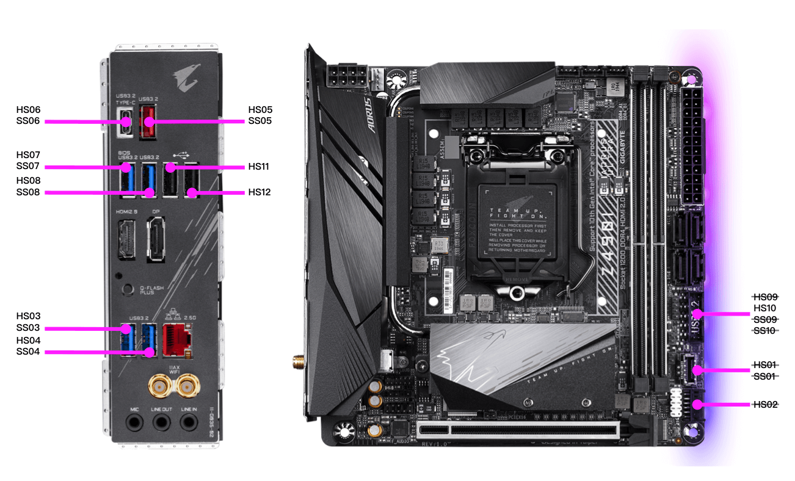
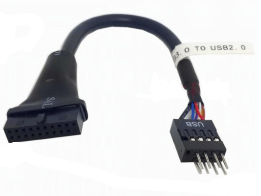

# Gigabyte-Z490i-Intel-10700k-5700XT

在基于技嘉Z490I AORUS ULTRA、Intel 10700k的平台上安装 MacOS Catalina 10.15.6

## 整机硬件

- 处理器：Intel 10700k
- 主板：Gigabyte Z490I AORUS ULTRA
- 内存：十铨火神DDR4 3200 16GB * 2
- 硬盘：WD_BLACK™ SN750 1TB NVMe™ SSD
- 显卡：Gigabyte RX5700XT AORUS/GAMING OC 8G
- 网卡：BCM94360CS2 NGFF + 内置天线 2根

## 功能

- 打开节能五项
- Wifi、蓝牙正常，支持隔空投送
- 音频正常
- 支持睡眠唤醒
- 定制好USB接口
- 板载Intel无线网卡和蓝牙模块可以使用（不完美）

## 安装步骤

为保证系统原始性，以下操作在白苹果上进行。

- 从 AppStore 下载 MacOS Catalina 10.15.6
- 准备一个 16GB U盘
- 格式化U盘
  - 插入U盘到白苹果
  - 打到『磁盘工具』-- 左上方『显示』--『显示所有设备』-- 选择你的U盘 -- 点击『抹掉』
    - 名称：USB
    - 格式：Mac OS扩展（日志式）
    - 方案：GUID分区图
    - 点击右下方『抹掉』，最后点击『完成』
- 将系统镜像写入U盘
  - 终端执行 `sudo /Applications/Install\ macOS\ Catalina.app/Contents/Resources/createinstallmedia --volume /Volumes/USB`
  - 输入密码，并回车
  - 提示将擦除U盘设备，是否继续。输入`y`并回车继续
  - 等待U盘写入完成
- 添加EFI到U盘
  - 打开 [OpenCore Configurator](https://mackie100projects.altervista.org/) 软件
  - 菜单栏『工具』 -- 『挂载EFI』
  - 在EFI分区中，找到U盘并点击『挂载分区』--『打开分区』
  - 将本项目中 **EFI** 目录拷贝至新打开的 **EFI分区中**
  - 至此安装U盘制作完成

## BIOS设置

- 关闭『快速启动』
- 关闭『CSM』
- 集成显卡『开启』（而非自动）
- 其它默认 

## 关于集成显卡iGPU UHD630

本方案中使用iGPU为计算加速，不用作画面输出。如果需要将集成显卡用作显示输出的修改 `config.plist`的iGPU配置为：

```xml
<key>PciRoot(0x0)/Pci(0x2,0x0)</key>
<dict>
  <key>AAPL,ig-platform-id</key>
  <data>BwCbPg==</data>
  <key>AAPL,slot-name</key>
  <string>Internal@0,2,0</string>
  <key>device-id</key>
  <data>mz4AAA==</data>
  <key>device_type</key>
  <string>Display controller</string>
  <key>framebuffer-con0-busid</key>
  <data>AQAAAA==</data>
  <key>framebuffer-con0-enable</key>
  <data>AQAAAA==</data>
  <key>framebuffer-con0-flags</key>
  <data>xwMAAA==</data>
  <key>framebuffer-con0-index</key>
  <data>AQAAAA==</data>
  <key>framebuffer-con0-pipe</key>
  <data>EgAAAA==</data>
  <key>framebuffer-con0-type</key>
  <data>AAQAAA==</data>
  <key>framebuffer-con1-busid</key>
  <data>BgAAAA==</data>
  <key>framebuffer-con1-enable</key>
  <data>AQAAAA==</data>
  <key>framebuffer-con1-flags</key>
  <data>xwMAAA==</data>
  <key>framebuffer-con1-index</key>
  <data>AgAAAA==</data>
  <key>framebuffer-con1-pipe</key>
  <data>EgAAAA==</data>
  <key>framebuffer-con1-type</key>
  <data>AAQAAA==</data>
  <key>framebuffer-con2-busid</key>
  <data>BAAAAA==</data>
  <key>framebuffer-con2-enable</key>
  <data>AQAAAA==</data>
  <key>framebuffer-con2-flags</key>
  <data>xwMAAA==</data>
  <key>framebuffer-con2-index</key>
  <data>AwAAAA==</data>
  <key>framebuffer-con2-pipe</key>
  <data>EgAAAA==</data>
  <key>framebuffer-con2-type</key>
  <data>AAgAAA==</data>
  <key>framebuffer-con3-busid</key>
  <data>AAAAAA==</data>
  <key>framebuffer-con3-enable</key>
  <data>AQAAAA==</data>
  <key>framebuffer-con3-flags</key>
  <data>IAAAAA==</data>
  <key>framebuffer-con3-index</key>
  <data>/////w==</data>
  <key>framebuffer-con3-pipe</key>
  <data>AAAAAA==</data>
  <key>framebuffer-con3-type</key>
  <data>AQAAAA==</data>
  <key>framebuffer-patch-enable</key>
  <data>AQAAAA==</data>
  <key>framebuffer-unifiedmem</key>
  <data>AAAAgA==</data>
  <key>hda-gfx</key>
  <string>onboard-1</string>
  <key>model</key>
  <string>Intel UHD Graphics 630</string>
</dict>
```

仅用作计算加速配置

```xml
<key>PciRoot(0x0)/Pci(0x2,0x0)</key>
<dict>
  <key>AAPL,ig-platform-id</key>
  <data>AwDImw==</data>
  <key>AAPL,slot-name</key>
  <string>Internal@0,2,0</string>
  <key>device-id</key>
  <data>xZsAAA==</data>
  <key>device_type</key>
  <string>VGA compatible controller</string>
  <key>model</key>
  <string>Intel UHD Graphics 630 (Desktop)</string>
</dict>
```


## USB定制方案

外部IO面板接口全部开启，主板内部只启用了HS10（用于连接蓝牙USB线，9pin公对20pin母的USB转接线输出的就是HS10端口）。



9pin公对20pin母的USB转接


## 蓝牙流畅度改善方法

- 2.4G WIFI网络频段与蓝牙存在信号冲突，条件允许的可以关掉路由2.4G信号频段
  - 关掉WIFI可以验证这个问题
- 在设置—网络—左下角设置—设定服务排序—将蓝牙拖至第一个
- 提升蓝牙默认比特率，执行以下几条命令
  - `defaults write com.apple.BluetoothAudioAgent "Apple Bitpool Min (editable)" 35`
  - `defaults write com.apple.BluetoothAudioAgent "Apple Initial Bitpool Min (editable)" 53`
  - `defaults write com.apple.BluetoothAudioAgent "Apple Initial Bitpool (editable)" 35`
- 内置天线的，尽量将两条天线分开一些

## 相关链接

- [Hackintosh-i7-10700K-Gigabyte-z490i-RX-5700-XT-Catalina-10.15.6](https://github.com/itendtostare/Hackintosh-i7-10700K-Gigabyte-z490i-RX-5700-XT-Catalina-10.15.6)
- [OpenCorePkg](https://github.com/acidanthera/OpenCorePkg)
- [OpenCore Configurator](https://mackie100projects.altervista.org/)
- [Hackintool](https://github.com/headkaze/Hackintool)
- [Intel核显platform ID整理及smbios速查表](https://blog.daliansky.net/Intel-core-display-platformID-finishing.html)
- [Getting started with OpenCore](https://dortania.github.io/OpenCore-Install-Guide/prerequisites.html)